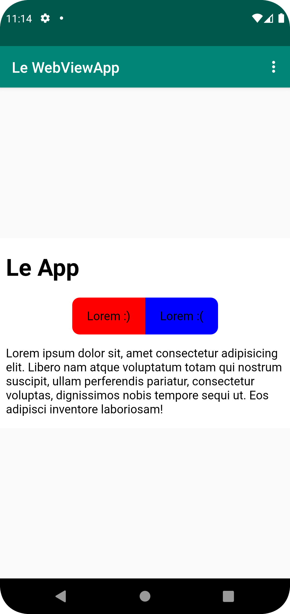
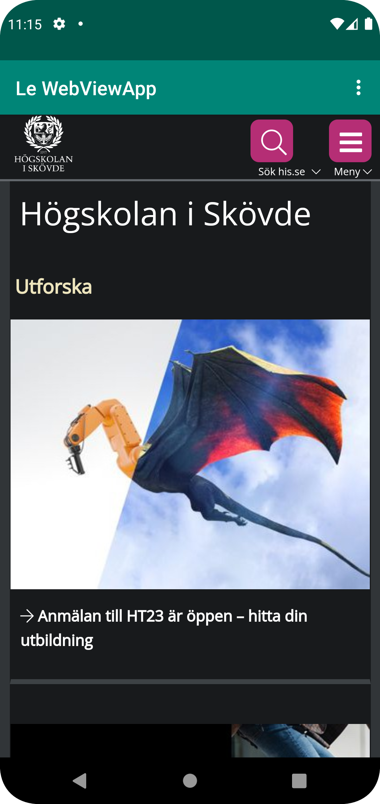

# Rapport

Först så ändrades namnet på appen genom att ändra texten i string taggarna i 
strings.xml filen.

Efter det så ska appen ha tillgång till internet vilket görs via koden i Kod 1 blocket.
Koden skrivs i AndroidManifest.xml filen och  att appen kan använda internet. 
```
<uses-permission android:name="android.permission.INTERNET" />
```
Kod 1: Ger internet åtkomst

Efter det så ändrades TextView elementet i activity_main.xml filen till ett WebView 
element och det var givet ett ID. Nu när det har ett ID så kan en variabel som påverkar
det elementet skapas i MainActivity java classen som visas i Kod 2. Java variabeln ges efter det en 
WebViewClient vilket gör att appen kan komma surfa internet. För att få det att fungera 
så bra som möjligt så aktiveras också javascript.

```
WebView myWebView;
@Override
protected void onCreate(Bundle savedInstanceState) {
    [.-.]

    myWebView = findViewById(R.id.my_webview);
    myWebView.setWebViewClient(new WebViewClient());
    myWebView.getSettings().setJavaScriptEnabled(true);
}
```
Kod 2: Skapar en variabel som ges en WebViewClient och javascript

I appen så finns två sidor: en intern och en extern sida. Den externa sidan länkar till his.se
och den interna sidan är sparad lokalt och skapad med lite HTML och CSS. För byta mellan sidorna 
så används de tre punkterna i det övre högra hörnet. Den interna sidan visas i bild 1 och den
externa visas i Bild 2. Sidorna laddas via loadUrl från separata funktioner: showInternalWebPage() 
respektive showExternalWebPage() som visas i Kod 3. När ett alternativ väljs så kallas en
funktion, onOptionsItemSelected(), som hämtar rätt sida beroende på ID:et, den funktionen visas i Kod 4.
Funktionen hämtar ID:et från en varabeln som kommer i parametern och sparar det i en annan variabel som
heter id. Den varabeln jämförs sedan för att se ifall id matchar ID:et för den interna eller
externa sidan och kallar rätt funktionen för att visa rätt sida.

```
public void showExternalWebPage(){ myWebView.loadUrl("https://his.se"); }
public void showInternalWebPage() { myWebView.loadUrl("file:///android_asset/about.html"); }
```
Kod 3: Funktionerna för att visa olika sidor

```
@Override
public boolean onOptionsItemSelected(MenuItem item) {
    int id = item.getItemId();
    if (id == R.id.action_external_web) {
        showExternalWebPage();
        return true;
    }

    if (id == R.id.action_internal_web) {         
        showInternalWebPage();
        return true;
    }
    return super.onOptionsItemSelected(item);
}
```
Kod 4: Funktionen för att bestämma vilken sida som ska visas



Bild 1: Internal webpage



Bild 2: External webpage